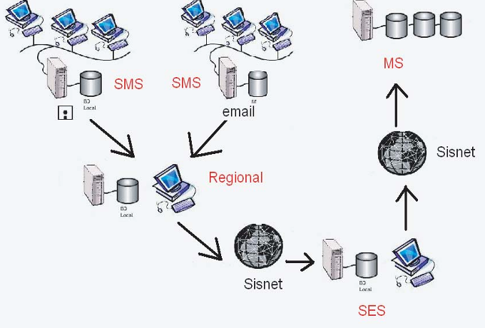
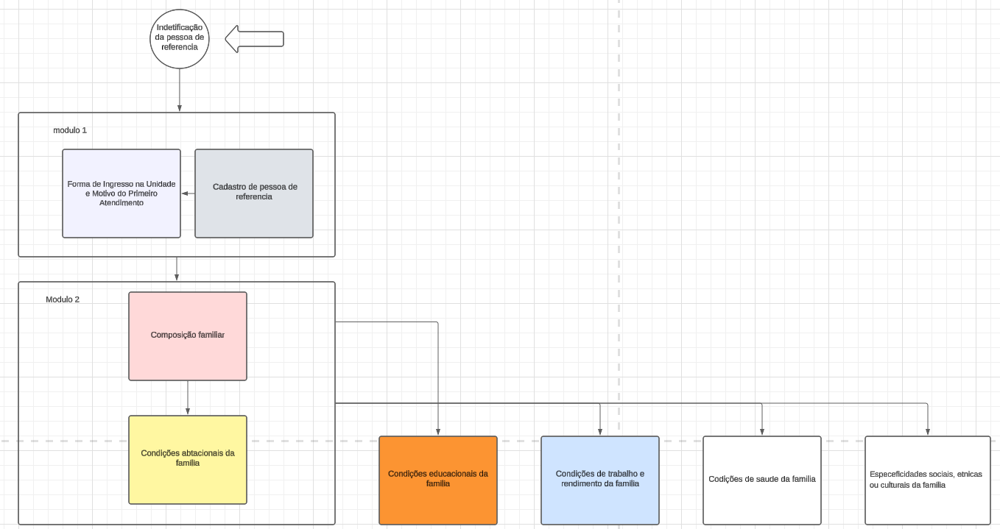
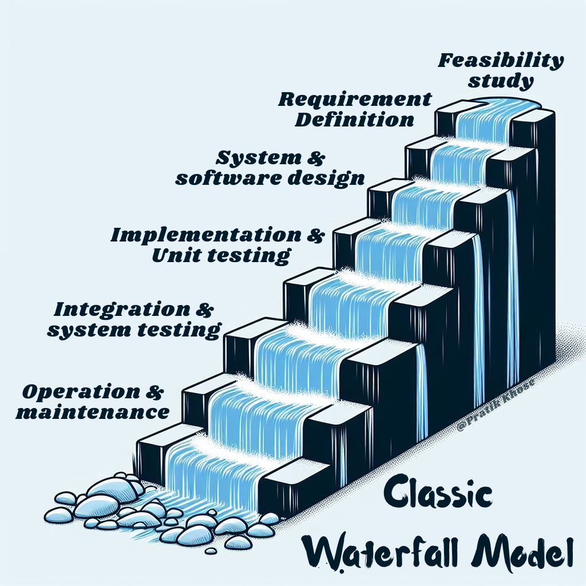
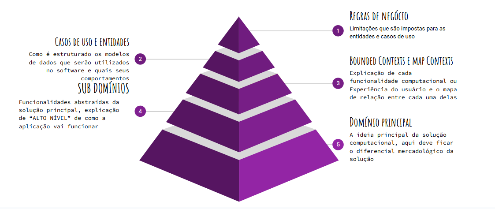

# Fundamentação Teórica

Os sistemas informatizados têm se consolidado como ferramentas indispensáveis na gestão da saúde, permitindo a coleta, organização e análise de dados essenciais para a melhoria dos serviços oferecidos à população. Essas soluções tecnológicas auxiliam na integração de informações entre diferentes níveis de atendimento e gestão, contribuindo para uma abordagem mais eficiente e fundamentada na tomada de decisões. Em um setor tão complexo como a saúde, sistemas que promovem o registro e o compartilhamento de informações desempenham um papel central na garantia da qualidade, segurança e acessibilidade dos serviços.

Dentro desse contexto, os sistemas de notificação emergem como instrumentos fundamentais, não apenas para monitorar condições críticas, mas também para ampliar o acesso a dados relevantes sobre eventos que impactam a saúde individual e coletiva. Essas ferramentas fortalecem a comunicação entre profissionais de saúde, gestores e usuários, promovendo um fluxo contínuo de informações que potencializa ações preventivas e corretivas. Dentre os diversos tipos de notificações, a notificação compulsória ocupa uma posição estratégica ao assegurar o registro e acompanhamento de condições que requerem atenção prioritária, como será detalhado na próxima seção.

## Sistemas de Notificação Compulsória

A notificação compulsória é um instrumento essencial de vigilância em saúde pública, exigindo o registro obrigatório de determinados agravos ou doenças por profissionais de saúde às autoridades sanitárias. Essa prática tem como fundamento a necessidade de monitorar condições que possam representar riscos à saúde coletiva, incluindo doenças transmissíveis, surtos epidêmicos e outras situações de interesse público. O principal objetivo da notificação compulsória é viabilizar uma resposta rápida e coordenada, auxiliando na implementação de ações eficazes de controle e prevenção.

Um sistema de notificação compulsória consiste em uma ferramenta informatizada que organiza e integra os dados provenientes das notificações realizadas. Esses sistemas desempenham um papel crucial na coleta, processamento e análise de informações sobre doenças e agravos em diferentes esferas administrativas, como municipal, estadual e nacional. Por meio desses dados, gestores de saúde conseguem identificar padrões epidemiológicos, acompanhar a evolução de doenças e desenvolver políticas públicas baseadas em evidências.

No Brasil, o Sistema de Informação de Agravos de Notificação (SINAN) é a principal plataforma para essa finalidade. Implantado de forma gradual a partir de 1993 e regulamentado em 1998, o SINAN foi desenvolvido para coletar e processar informações sobre doenças e agravos de notificação compulsória. Alimentado por notificações registradas por profissionais de saúde em unidades públicas e privadas de todo o país, o SINAN armazena dados que abrangem informações epidemiológicas e registros detalhados de investigações clínicas e laboratoriais. Seu principal objetivo é subsidiar a vigilância epidemiológica ao possibilitar a identificação de surtos, o monitoramento de tendências e a análise de riscos à saúde pública. Além disso, o sistema permite que estados e municípios incluam agravos específicos, ampliando sua aplicabilidade regional e sua utilidade para a saúde pública.

*Fonte: Manual de Normas e Rotinas do SINAN, 2ª edição.*

A arquitetura do SINAN é descentralizada, o que significa que os dados são coletados, registrados e processados em diferentes níveis administrativos — municipal, estadual e federal. No nível municipal, as unidades de saúde são responsáveis pelo registro inicial das notificações e pelo envio das informações ao nível estadual. Os estados, por sua vez, consolidam os dados recebidos de seus municípios, fornecem suporte técnico às unidades locais e repassam as informações ao nível federal. No nível federal, os dados consolidados são centralizados, permitindo análises epidemiológicas e a retroalimentação dos sistemas estaduais e municipais com informações agregadas. Esse fluxo hierárquico e organizado garante que os dados fluam de maneira eficiente e sistemática por meio de arquivos eletrônicos e compactados, assegurando a integridade e a segurança das informações. A alimentação regular e a atualização contínua são indispensáveis para que o sistema continue eficaz no apoio à vigilância epidemiológica.

O SINAN desempenha um papel fundamental na saúde pública brasileira ao oferecer uma base confiável de dados para a formulação de políticas e estratégias sanitárias. Por meio de suas funcionalidades, o sistema possibilita a identificação de surtos, a análise de tendências epidemiológicas e a avaliação da eficácia de intervenções em saúde pública. Além disso, ao democratizar as informações, o SINAN se torna uma ferramenta indispensável para a tomada de decisões de gestores e profissionais de saúde, promovendo uma abordagem baseada em dados concretos e alinhada às necessidades regionais e nacionais.

## Sistema Único de Assistência Social

O Sistema Único de Assistência Social (SUAS) é uma política pública nacional que organiza a assistência social no Brasil como direito do cidadão e dever do Estado. Regulamentado pela Política Nacional de Assistência Social (PNAS) e pela Lei Orgânica da Assistência Social (LOAS), o SUAS atua para garantir proteção social a indivíduos e famílias em situação de vulnerabilidade ou risco. A estrutura do SUAS baseia-se em dois níveis de proteção: a Proteção Social Básica, oferecida pelos Centros de Referência de Assistência Social (CRAS), e a Proteção Social Especial, articulada pelos Centros de Referência Especializados de Assistência Social (CREAS).

O CRAS é a principal porta de entrada do SUAS, sendo responsável por prevenir situações de risco social e fortalecer os vínculos familiares e comunitários. Ele oferece serviços como o Programa de Atenção Integral à Família (PAIF), que atende famílias em situação de vulnerabilidade social, promovendo o desenvolvimento de suas capacidades. Além disso, o CRAS desempenha um papel fundamental na organização do território em que está inserido. **"A partir do adequado conhecimento do território, o CRAS promove a organização e articulação das unidades da rede socioassistencial e de outras políticas. Assim, possibilita o acesso da população aos serviços, benefícios e projetos de assistência social, se tornando uma referência para a população local e para os serviços setoriais"** [8]. Esse papel torna o CRAS não apenas um espaço de atendimento, mas também um ponto de integração entre diferentes políticas públicas e ações sociais.

O CREAS, por sua vez, é voltado para situações mais complexas que envolvem a violação de direitos, como violência doméstica, trabalho infantil e abandono. Ele opera por meio do Serviço de Proteção e Atendimento Especializado a Famílias e Indivíduos (PAEFI), que busca promover a superação dessas situações e reconstruir vínculos familiares e comunitários. A atuação do CREAS depende de uma compreensão aprofundada dos territórios em que vivem as famílias atendidas, pois essa análise é essencial para a definição de ações eficazes. Conforme descrito, **"A compreensão dos territórios onde vivem e convivem as famílias e indivíduos em situação de vulnerabilidade, risco pessoal e social, por violação de direitos, é fundamental, portanto, para o planejamento e a organização das ações do SUAS. Considerá-los e compreendê-los é trilhar um caminho para construir uma efetiva política garantidora de direitos"** [9]. Essa abordagem reforça o papel do CREAS como agente de transformação social, capaz de identificar as demandas específicas de cada território e promover respostas integradas e assertivas.

O **Protocolo SUAS** é um instrumento padronizado composto por um conjunto de formulários que organizam e registram informações essenciais das famílias atendidas pelos serviços socioassistenciais, como CRAS e CREAS. Essa padronização é fundamental para garantir a qualidade do trabalho social, promovendo um acompanhamento planejado e sistemático das famílias. Como destaca o documento, "O Prontuário SUAS se materializa na medida em que os profissionais responsáveis pelo trabalho social com famílias se comprometem a efetivar o serviço de acompanhamento familiar no âmbito do SUAS. Esta direção pressupõe planejamento de atividades, organização do trabalho e registro sistemático de informações e implica em instrumentos técnicos que promovam a organização, estruturação e padronização de informações sobre o acompanhamento das famílias" [10].

A estrutura do protocolo abrange diversos blocos temáticos que registram dados de identificação, composição familiar, condições habitacionais, educacionais, de trabalho, de saúde e acesso a benefícios, entre outros. Cada formulário é preenchido de forma contínua e sistemática, respeitando o contexto e a dignidade dos usuários. O uso de um prontuário padrão não apenas organiza informações, mas também "traz a possibilidade de reconhecer os riscos, as vulnerabilidades, como também os recursos e possibilidades de enfrentá-los. Traz a possibilidade de captar as circunstâncias sociais do indivíduo e de sua família como determinante para a sua proteção e ainda traz a possibilidade de, a partir das informações produzidas e registradas pelos profissionais, auxiliar a construção de análises coletivas e territorializadas do perfil da capacidade protetiva das famílias" [10].

Além de garantir intervenções mais eficazes e direcionadas, o protocolo fortalece a análise territorial e o planejamento estratégico das ações, promovendo um trabalho socioassistencial mais alinhado às necessidades específicas das famílias e do território em que estão inseridas. Ele é, portanto, um marco técnico e cultural que qualifica o trabalho social e amplia a capacidade de enfrentamento das vulnerabilidades enfrentadas pelas famílias.

*Fonte: Elaborado pelo autor.*

A pessoa de referência desempenha um papel fundamental no contexto do **Prontuário SUAS**. Ela é responsável por centralizar as informações da unidade familiar, facilitando o planejamento e a execução de intervenções sociais. Além de simplificar o contato direto com a família, a pessoa de referência permite que os profissionais tenham uma visão mais clara e personalizada sobre as demandas, vulnerabilidades e potencialidades do grupo familiar. Esse papel contribui para estabelecer vínculos entre a família e os serviços socioassistenciais, promovendo ações mais eficazes e alinhadas às necessidades específicas do núcleo familiar.

Em conclusão, o **Protocolo SUAS** é uma ferramenta essencial para a sistematização e compilação de dados no âmbito da assistência social. Ele não apenas organiza informações importantes para o acompanhamento das famílias, mas também possibilita a geração de análises coletivas e territorializadas que embasam o planejamento de políticas públicas. A partir de dados não sensíveis, pode-se socializar informações relevantes para a formulação de estratégias e intervenções em saúde pública, ampliando a capacidade do Estado de atender às necessidades da população com maior precisão e eficiência. Assim, o protocolo é um pilar indispensável para a gestão integrada e eficaz das políticas sociais e de saúde pública.

## Arquitetura de sistemas

A arquitetura de software pode ser compreendida como o conjunto de decisões fundamentais que define a organização de um sistema, englobando a divisão em componentes, suas interações e diretrizes para o desenvolvimento. Ela funciona como uma abstração que permite gerenciar a complexidade inerente a sistemas modernos, garantindo que as demandas de funcionalidade, desempenho e escalabilidade sejam atendidas de maneira coesa. Como afirma Robert C. Martin, "a forma dada a esse sistema pelos seus criadores" [4], é um reflexo de como seus componentes foram organizados e conectados.

A arquitetura desempenha um papel essencial ao longo do ciclo de vida do software, assegurando a clareza na construção, manutenção e evolução de sistemas de informação. Ela organiza as camadas do sistema de modo a facilitar a implementação e, ao mesmo tempo, assegurar que as mudanças necessárias sejam incorporadas com eficiência. Robert C. Martin ressalta que "o propósito primário da arquitetura é suportar o ciclo de vida do sistema. Uma boa arquitetura torna o sistema fácil de entender, fácil de desenvolver, fácil de manter e fácil de implantar" [4].

O uso de uma arquitetura sólida proporciona vantagens como modularidade, flexibilidade e uma redução significativa no impacto de mudanças futuras. Ao planejar o software com base em uma estrutura bem definida, torna-se mais fácil adaptar o sistema às mudanças tecnológicas ou de negócio, garantindo sua escalabilidade e longevidade. Robert C. Martin destaca que "uma boa arquitetura deve proteger a maior parte do código-fonte dessas mudanças. Deve deixar o modo de desacoplamento aberto como uma opção para que as implantações grandes possam utilizar um modo e as pequenas, outro" [4].

### Clean Architecture

Embora Robert C. Martin, no livro *Clean Architecture*, não tenha proposto uma arquitetura específica, ele apresentou um conjunto de princípios e regras comuns às arquiteturas bem-sucedidas, baseados na análise de vários estudos de caso. Esses princípios destacam a separação entre as regras de negócio e os detalhes externos, como frameworks, bancos de dados e interfaces, promovendo independência e modularidade. Como Martin afirma, "o objetivo da arquitetura de software é minimizar os recursos humanos necessários para construir e manter um determinado sistema" [4]. Essa abordagem busca facilitar a manutenção, escalabilidade e testabilidade, garantindo que mudanças em tecnologias ou requisitos não comprometam o núcleo do sistema. Apesar de Martin não ter criado uma "Clean Architecture" propriamente dita, seu livro inspirou profissionais e pesquisadores a propor arquiteturas baseadas nesses conceitos, gerando uma ampla produção de artigos e discussões sobre o tema.

A aplicação dos princípios descritos no livro *Clean Architecture* em um projeto de back-end para uma API REST se justifica pela capacidade dessa abordagem de organizar o sistema em camadas com responsabilidades bem definidas. Como destacado por Robert C. Martin:

> "Embora todas essas arquiteturas variem de alguma forma em seus detalhes, elas são muito similares. Todas têm o mesmo objetivo: a separação das preocupações. Todas realizam essa separação ao dividirem o software em camadas. Cada uma tem, pelo menos, uma camada para regras de negócio e uma camada para interfaces de usuário e sistema." [4]

Seguindo essa filosofia, a *Clean Architecture* garante que as regras de negócio estejam isoladas dos detalhes externos, como frameworks, banco de dados ou protocolos de comunicação, promovendo modularidade e flexibilidade. Isso é especialmente valioso em APIs REST, onde mudanças frequentes nos requisitos de negócio ou na infraestrutura técnica são comuns.

A separação em camadas facilita a manutenção, melhora a testabilidade e aumenta a escalabilidade do sistema. A seguir, será apresentada uma explicação detalhada das camadas utilizadas nessa abordagem, destacando suas responsabilidades e benefícios específicos para a construção de uma API REST.

*Fonte: Martin, Robert C. Diagrama da Clean Architecture. The Clean Code Blog, 2012.*

#### Entidades
As entidades, no contexto da *Clean Architecture*, representam o núcleo do sistema e encapsulam as regras de negócio mais fundamentais e atemporais. Elas combinam dados e comportamentos de forma coesa, centralizando a lógica do domínio e garantindo que as operações respeitem as regras estabelecidas. Diferentemente de simples estruturas de dados, as entidades são projetadas para conter métodos e lógica que asseguram a consistência do sistema, independentemente de detalhes externos como frameworks, bancos de dados ou interfaces.

Esse encapsulamento ocorre ao unir propriedades que representam o estado da entidade com métodos que aplicam as regras de negócio associadas. Por exemplo, em um sistema de aluguel de veículos, uma entidade `Carro` poderia conter informações como placa, modelo e status, que indica se o carro está disponível, alugado ou em manutenção. Além de armazenar esses dados, ela implementa regras importantes, como permitir o aluguel apenas se o carro estiver disponível ou liberar o carro após o término da manutenção. Isso assegura que todas as interações com a entidade sejam consistentes e controladas.

Adicionalmente, **"recomenda-se que esta camada evite utilizar tecnologias e frameworks para efetuar as verificações, a fim de prevenir dependências e acoplamento com a camada de 'Framework e Drivers', pois isso configura uma violação à Clean Architecture"** [7]. Seguindo esse princípio, as entidades mantêm sua autonomia e independência, garantindo que o núcleo do sistema não seja impactado por mudanças externas.

#### Casos de Uso (Use Cases)
A camada de *Use Cases* é responsável por orquestrar a lógica de aplicação, conectando as regras de negócio encapsuladas nas entidades com os requisitos específicos da aplicação. Essa camada define como o sistema deve responder a solicitações externas, garantindo que as operações sejam realizadas de forma consistente e alinhadas às regras do domínio. Os casos de uso representam a lógica operacional do sistema, descrevendo os processos que transformam os dados recebidos em ações ou resultados esperados.

Uma característica essencial dessa camada é sua dependência exclusiva da camada de entidades, como enfatizado na citação: "Ela depende apenas da camada interna da entidade, que representa os conceitos e as regras de negócio do domínio da aplicação" [7]. Essa independência assegura que a lógica de aplicação permaneça desacoplada de detalhes externos, como frameworks, bancos de dados ou interfaces de usuário, permitindo que as mudanças em tecnologias ou infraestrutura não impactem o núcleo funcional do sistema.

Por exemplo, em um sistema de aluguel de veículos, um caso de uso como `RealizarAluguel` pode orquestrar o processo de verificar a disponibilidade do carro, atualizar o status da entidade `Carro` para "alugado" e notificar o cliente sobre a reserva confirmada. Esse fluxo de operações garante que as regras do domínio sejam respeitadas, enquanto abstrai os detalhes de implementação, como como os dados são recebidos ou enviados. Assim, a camada de *Use Cases* serve como um elo entre o núcleo do sistema (as entidades) e as camadas externas, como adaptadores de interface, garantindo modularidade e robustez ao projeto.

#### Adaptadores de Interface (Interface Adapters)
A camada de *Interface Adapters* é responsável por adaptar os dados entre as camadas internas do sistema e os agentes externos, promovendo a comunicação eficiente e desacoplada entre elas. **"Essa camada tem a função de adaptar os dados entre as camadas mais internas e os agentes externos. Ela inclui os presenters, que formatam os dados para a interface do usuário, os controladores, que recebem as requisições do usuário e chamam os serviços adequados, e os gateways, que abstraem a comunicação com fontes externas de dados, como banco de dados, comunicação com outras APIs ou até mesmo sistemas operacionais ou hardwares"** [7].

Os *controllers*, no contexto da *Clean Architecture*, desempenham o papel de receber e responder às requisições dos clientes na camada externa do sistema. **"Os controladores, no contexto do Clean Architecture, são encarregados de receber e responder requisições dos clientes na camada externa do sistema, seja por meio de interfaces web ou dispositivos"** [7]. Em um sistema de aluguel de carros, o *controller* seria responsável por processar uma solicitação de aluguel feita pelo cliente. Ao receber a requisição, ele valida as informações fornecidas, como o identificador do carro e os dados do cliente. Após isso, o *controller* invoca o caso de uso correspondente, que realiza o processo de aluguel. Uma vez que o caso de uso conclui sua execução, o *controller* retorna a resposta ao cliente, formatada no padrão esperado, como JSON, para garantir uma comunicação eficiente e alinhada às necessidades do sistema externo.

Já os *presenters* têm a responsabilidade de formatar os dados processados pelo sistema em um formato mais acessível e conveniente para os usuários ou sistemas externos. **"Essa camada desempenha a função de converter os dados em formatos mais acessíveis e convenientes, adequados a cada caso de uso específico. O apresentador, em alguns casos, também abrange as visões e os modelos de visualização. Essa camada deve ser simples e intuitiva, sem envolver regras de negócio"** [7]. No exemplo do sistema de aluguel de carros, após o caso de uso concluir o processo, o *presenter* recebe as informações do aluguel e as transforma em um formato amigável. Ele organiza os dados para que mostrem apenas o essencial, como o modelo do carro alugado, as datas de retirada e devolução, e o valor total. Isso garante que os dados sejam claros e compreensíveis, sem incluir detalhes técnicos ou complexos, proporcionando uma experiência intuitiva para o cliente. Assim, os *presenters* se concentram exclusivamente na apresentação dos resultados, mantendo-se livres de qualquer lógica de negócio.

Os *gateways* desempenham um papel crucial na *Clean Architecture* ao gerenciar a comunicação entre a aplicação e o ambiente externo. **"O gateway do Clean Architecture desempenha um papel fundamental ao estabelecer a comunicação entre nossa aplicação e o ambiente externo. Essa camada é responsável por interagir com APIs, bancos de dados, serviços de mensageria, entre outros componentes externos. É essencial que as alterações realizadas no gateway não afetem negativamente o funcionamento da aplicação como um todo"** [7]. Eles atuam como intermediários que encapsulam a lógica necessária para conectar a aplicação com esses serviços externos, garantindo que as camadas internas permaneçam independentes de detalhes de implementação específicos.

No exemplo de um sistema de aluguel de carros, um *gateway* poderia ser responsável por acessar um banco de dados para recuperar as informações sobre os veículos disponíveis para aluguel. Ele receberia uma solicitação da camada de casos de uso, executaria a consulta no banco de dados e retornaria os dados em um formato que o caso de uso pudesse compreender. Caso o banco de dados seja alterado, como migrar de um sistema relacional para um banco NoSQL, a modificação seria feita apenas no *gateway*, sem afetar as camadas internas ou a lógica do sistema.

Essa separação promove a modularidade e a flexibilidade do sistema, permitindo que mudanças nos componentes externos, como APIs ou tecnologias de banco de dados, sejam tratadas de forma isolada. Dessa forma, os *gateways* protegem o núcleo da aplicação, assegurando que o sistema como um todo continue funcionando de maneira consistente, mesmo diante de mudanças na infraestrutura externa.

#### Frameworks e Drivers
A camada de *Frameworks e Drivers* é a mais externa na *Clean Architecture* e serve como a interface do sistema com as ferramentas e tecnologias externas. **"A camada mais externa do Clean Architecture é tipicamente composta por frameworks e ferramentas, como o banco de dados e a camada web. Nesse nível, a programação se concentra principalmente na comunicação com a camada interna"** [7]. Essa camada inclui elementos como bibliotecas de frameworks web, gerenciadores de banco de dados, serviços de mensageria e APIs de terceiros, todos os quais são necessários para que o sistema funcione no ambiente desejado.

No contexto de um sistema de aluguel de carros, essa camada poderia incluir um framework web usado para lidar com requisições HTTP, como Express.js, Django ou Spring Boot. Também poderia envolver o sistema de banco de dados utilizado para armazenar informações sobre veículos e clientes, como PostgreSQL ou MongoDB. No entanto, é importante destacar que o papel dessa camada é meramente funcional: ela implementa os mecanismos de comunicação e execução, mas não contém lógica de negócio.

Uma característica essencial dessa camada é seu isolamento das partes internas do sistema. Os elementos aqui são projetados para se comunicar com as camadas internas sem impactar diretamente o núcleo do sistema, como os casos de uso ou as entidades. Isso garante que, se for necessário trocar um framework ou mudar de banco de dados, essas alterações possam ser realizadas sem afetar as camadas mais internas. Assim, a camada de *Frameworks e Drivers* permite flexibilidade tecnológica, ao mesmo tempo que sustenta a organização modular proposta pela *Clean Architecture*.

A *Clean Architecture* oferece uma vantagem significativa para aplicações RESTful ao garantir o desacoplamento entre regras de negócio e detalhes de infraestrutura. Essa abordagem promove flexibilidade e resiliência, facilitando a manutenção, a escalabilidade e a evolução do sistema. Além disso, sua estrutura modular permite que equipes desenvolvam e testem partes da aplicação de forma independente, assegurando que mudanças tecnológicas não afetem a funcionalidade essencial. **"As boas arquiteturas devem ser centradas em casos de uso para que os arquitetos possam descrever com segurança as estruturas que suportam esses casos de uso, sem se comprometerem com frameworks, ferramentas e ambientes"** [4]. Essa centralização nos casos de uso garante que as decisões arquiteturais sejam guiadas pelos requisitos do negócio e não por limitações impostas por ferramentas externas, resultando em sistemas mais robustos e adaptáveis a mudanças no longo prazo.

### Model View ViewModel (MVVM)

O padrão Model-View-ViewModel (MVVM) foi introduzido pela Microsoft como uma extensão do padrão Model-View-Controller (MVC), projetado especialmente para melhorar o desenvolvimento de aplicações baseadas em interfaces gráficas ricas, como aquelas criadas com Windows Presentation Foundation (WPF). Esse padrão divide a aplicação em três componentes principais: o **Model**, que representa os dados e a lógica de negócios; a **View**, responsável por apresentar os dados ao usuário e lidar com interações visuais; e o **ViewModel**, que atua como um intermediário entre a View e o Model, gerenciando o estado da interface e traduzindo os dados do Model em um formato utilizável pela View. Essa separação de responsabilidades facilita a testabilidade, a manutenção do código e a escalabilidade, além de promover uma arquitetura desacoplada e modular para o desenvolvimento de aplicações modernas.

No padrão MVVM, o **Model** é a camada responsável por gerenciar os dados da aplicação e a lógica de negócios associada. Ele encapsula as regras do domínio da aplicação, garantindo que as operações e manipulações de dados sigam as normas e condições necessárias. Essa camada inclui estruturas como classes de dados, validações, cálculos e interações com fontes de dados externas, como bancos de dados ou APIs. O Model é completamente independente das outras camadas, o que permite que ele seja reutilizado em diferentes contextos ou interfaces de usuário.

Além disso, o **Model** é frequentemente usado em conjunto com serviços ou repositórios que encapsulam o acesso aos dados e o cache. Como descrito, "as classes de modelo são normalmente utilizadas em conjunto com serviços ou repositórios que encapsulam o acesso aos dados e o cache" [6]. Essa abordagem desacopla a lógica de negócios da interface visual, tornando o código mais modular e facilitando a testabilidade. Por ser uma camada crítica no fluxo da aplicação, o Model deve ser projetado para ser robusto, eficiente e escalável, já que suas falhas podem impactar diretamente as demais camadas e o funcionamento geral do sistema.

*Fonte: FLUTTER DOCUMENTATION TEAM. App Architecture Guide. Flutter Documentation, 2024.*

O **Repository** é um padrão arquitetural frequentemente utilizado em conjunto com o MVVM para gerenciar o acesso a dados, funcionando como uma abstração entre o **Model** e as fontes de dados externas, como APIs, bancos de dados locais ou serviços de terceiros. Ele centraliza a lógica de acesso e manipulação dos dados, permitindo que as demais camadas da aplicação não precisem conhecer detalhes sobre como os dados são obtidos ou armazenados. Essa separação melhora a modularidade e facilita a substituição ou modificação das fontes de dados sem afetar o restante da aplicação. Além disso, o Repository pode implementar estratégias como cache de dados, validação e tratamento de erros, fornecendo uma interface consistente e confiável para o ViewModel e reduzindo a complexidade da aplicação. É importante observar que "os repositórios nunca devem estar cientes uns dos outros. Se sua aplicação possui lógica de negócios que precisa de dados provenientes de dois repositórios, esses dados devem ser combinados no ViewModel ou na camada de domínio, especialmente se a relação entre repositório e ViewModel for complexa" [5].

O **Service** é uma camada de abstração que lida diretamente com a comunicação externa do aplicativo, como chamadas a APIs, acesso a serviços remotos ou interações com recursos da plataforma, como sensores ou notificações. Ele é responsável por realizar as operações que requerem conectividade ou integração com sistemas externos, traduzindo essas interações em dados utilizáveis para o **Repository**. Essa abordagem mantém o código limpo e organizado, permitindo que o Repository utilize os dados processados pelos Services sem se preocupar com os detalhes técnicos dessas interações. Além disso, "os serviços e os repositórios possuem uma relação de muitos para muitos. Um único repositório pode usar vários serviços, e um serviço pode ser usado por vários repositórios" [5]. Essa estrutura promove a modularidade, facilitando a manutenção e a substituição de serviços ou APIs externas sem impacto significativo no restante da aplicação.

No padrão MVVM, o **ViewModel** é o componente que serve como um intermediário entre a **View** e o **Model**, sendo responsável por gerenciar o estado da interface do usuário e transformar os dados do Model em um formato que a View possa apresentar. Ele contém a lógica que liga a interface ao comportamento da aplicação, garantindo que as mudanças de estado ou dados sejam refletidas automaticamente na interface e vice-versa. Essa interação é frequentemente implementada com o uso de streams ou notificações reativas, como o padrão ValueNotifier no Flutter, permitindo que a View escute e reaja às mudanças no estado do ViewModel.

Adicionalmente, "o ViewModel também é responsável por coordenar as interações da View com quaisquer classes de Model necessárias. Normalmente, existe uma relação de um-para-muitos entre o ViewModel e as classes de Model. O ViewModel pode optar por expor diretamente as classes de Model para a View, permitindo que controles na View realizem data binding diretamente com elas. Nesse caso, as classes de Model precisarão ser projetadas para dar suporte ao data binding e a eventos de notificação de mudanças" [6]. Essa abordagem reforça a função do ViewModel como orquestrador, processando as entradas da View, realizando operações no Model ou Repository, e atualizando o estado exposto para a interface.

Além disso, o ViewModel não possui referências diretas à interface do usuário, tornando-o facilmente testável. Ele age como um orquestrador, processando as entradas da View, realizando operações no Model ou Repository, e atualizando o estado exposto para a interface. Essa separação permite um design desacoplado, onde a lógica da aplicação e os detalhes da interface permanecem independentes. No Flutter, o ViewModel é ideal para lidar com a complexidade das UIs reativas, permitindo uma estruturação clara entre a apresentação visual e a lógica de negócios subjacente, garantindo escalabilidade e manutenção eficientes.

A **View** no padrão MVVM é a camada responsável por definir a interface gráfica que o usuário interage. Ela cuida da estrutura, do layout e da aparência dos elementos exibidos na tela. Como descrito, "a View é responsável por definir a estrutura, o layout e a aparência do que o usuário vê na tela. Idealmente, cada View é definida em XAML, com um código-behind limitado que não contém lógica de negócios" [6]. Essa separação mantém a lógica de negócios fora da interface e garante que a camada de apresentação seja simples e focada apenas em sua função principal: a exibição de informações e a captura de interações do usuário.

No Flutter, as Views são representadas pelas classes de widgets da aplicação. "As Views são o método principal de renderização da interface do usuário e não devem conter nenhuma lógica de negócios. Elas devem receber todos os dados necessários para renderização do ViewModel" [5]. Essa abordagem destaca que as Views não devem se preocupar com o estado ou lógica de negócios, permitindo que sejam reativas e orientadas exclusivamente pela camada de ViewModel.

Independente da linguagem ou framework utilizado, a View é sempre a camada mais acoplada à tecnologia empregada. No .NET, por exemplo, é recomendado o uso de XAML para definir a interface visual, enquanto no Flutter, o foco está nos widgets e nas ferramentas específicas do framework. Portanto, ao implementar o padrão MVVM, é essencial seguir as recomendações da plataforma escolhida, garantindo que a View utilize as melhores práticas e tecnologias nativas para oferecer uma experiência consistente e eficiente ao usuário.

A maior vantagem do padrão MVVM é a independência entre a **View** e o **ViewModel**, permitindo que a interface gráfica (View) seja completamente modificada, reestruturada ou até substituída sem impactar a lógica de negócios ou o gerenciamento de estado presentes no ViewModel. Isso ocorre porque o ViewModel é projetado para ser totalmente desacoplado da View, não contendo referências diretas a elementos visuais. Essa separação de responsabilidades proporciona uma flexibilidade significativa no desenvolvimento de aplicações, permitindo que mudanças na interface sejam realizadas sem alterar o restante do código.

Com essa modularidade, é possível criar diferentes interfaces para o mesmo conjunto de funcionalidades, como layouts específicos para dispositivos móveis e desktops, utilizando o mesmo ViewModel como base. Essa característica torna o código mais sustentável, facilitando a manutenção, a adaptação a novos requisitos visuais e o suporte a múltiplas plataformas. A capacidade de modificar a interface sem interferir na lógica subjacente é uma das principais razões pelas quais o MVVM é amplamente adotado em projetos que exigem escalabilidade e longevidade no desenvolvimento.

## Protocolo HTTP

O **HTTP (HyperText Transfer Protocol)** teve sua origem no início da década de 1990, quando **Tim Berners-Lee** desenvolveu a World Wide Web (WWW) no **CERN**. Sua primeira versão, o **HTTP/0.9**, era extremamente simples, permitindo apenas a transferência de páginas HTML puras através de uma única conexão TCP. Com o crescimento da Web e suas necessidades mais complexas, em 1996 foi introduzido o **HTTP/1.0**, que trouxe melhorias importantes, como cabeçalhos de requisição e resposta, permitindo a transferência de diversos tipos de conteúdos. Pouco depois, o **HTTP/1.1**, lançado em 1997, se consolidou como padrão ao introduzir conexões persistentes, compressão e suporte a cache, otimizando o desempenho e reduzindo a sobrecarga de novas conexões.

Uma das grandes características do HTTP é sua **generidade**, que permitiu sua utilização em diversas aplicações além da Web. *"Embora o HTTP tenha sido projetado para utilização na Web, ele foi intencionalmente criado de modo mais geral que o necessário, visando às futuras aplicações orientadas a objetos"* [11]. Essa flexibilidade possibilitou sua adoção em diferentes contextos, como APIs RESTful, serviços de mídia em streaming e até mesmo em dispositivos IoT (Internet das Coisas), reforçando sua importância como um protocolo universal para comunicação de dados.

O **HTTP** passou por diversas evoluções desde sua criação, adaptando-se às crescentes necessidades da Web. A primeira versão, **HTTP/0.9**, lançada em 1990, era extremamente simples, permitindo apenas a transferência de arquivos **HTML** em texto puro e utilizando uma única conexão TCP. Com o **HTTP/1.0**, em 1996, surgiram avanços importantes, como cabeçalhos de requisição e resposta, permitindo a transferência de diferentes tipos de conteúdos. A versão **HTTP/1.1**, lançada em 1997, trouxe melhorias significativas, como conexões persistentes e suporte a chunked transfer encoding, otimizando a comunicação. *"A vantagem de usar o TCP é que nem os navegadores nem os servidores têm de se preocupar com mensagens longas, confiabilidade ou controle de congestionamento. Todos esses assuntos são tratados pela implementação do TCP"* [11]. Esse suporte fornecido pelo TCP ajudou o HTTP a se tornar o padrão dominante para transferência de dados na Web.

Com o aumento das demandas por velocidade, eficiência e maior complexidade dos conteúdos, o **HTTP/2** foi introduzido em 2015 como uma evolução necessária. Ele trouxe avanços significativos, como a **multiplexação**, que permite enviar múltiplas requisições simultâneas em uma única conexão TCP, evitando o problema do *head-of-line blocking* presente no HTTP/1.1. Além disso, foi implementada a **compressão de cabeçalhos**, que reduz o tamanho das mensagens e melhora a latência, especialmente em ambientes com grandes volumes de dados. Outro ponto discutido durante o desenvolvimento do **HTTP/2** foi a criptografia. *"A criptografia foi um ponto sensível durante o desenvolvimento do HTTP/2. Algumas pessoas queriam muito e outras se opunham igualmente. A oposição estava principalmente relacionada às aplicações da IoT, em que a 'coisa' não tem muito poder de computação. No final, a criptografia não foi exigida pelo padrão, mas todos os navegadores a exigem, então ela de fato existe de qualquer maneira, pelo menos para a navegação na Web"* [11]. Essa exigência prática consolidou o uso do **HTTPS** como padrão, garantindo maior segurança na Web.

Já o **HTTP/3**, a última grande revisão do protocolo, apresenta mudanças fundamentais em sua arquitetura. Como enfatizam os autores, *"Sua principal diferença é o protocolo de transporte usado para dar suporte às mensagens HTTP: em vez de depender do TCP, ele depende de uma versão aumentada do UDP chamada QUIC, que conta com o controle de congestionamento do espaço do usuário executado em cima do UDP. O HTTP/3 começou simplesmente como HTTP-over-QUIC e se tornou a última revisão principal proposta para o protocolo"* [11]. O uso do **QUIC** resolve problemas de latência e perda de pacotes encontrados no TCP, tornando o **HTTP/3** mais eficiente em redes instáveis. Isso proporciona conexões rápidas e resilientes, fundamentais para as demandas da Internet moderna, especialmente em cenários móveis e de alta performance.

Os **métodos HTTP** definem as ações que podem ser realizadas em um recurso identificado por uma URL e são essenciais para a comunicação entre clientes e servidores. Os métodos mais comuns incluem o **GET**, usado para solicitar a representação de um recurso, retornando dados sem alterar o estado no servidor; o **POST**, que envia dados ao servidor para criar ou modificar recursos; e o **PUT**, responsável por substituir ou criar recursos. O **DELETE** é utilizado para remover um recurso específico, enquanto o **PATCH** permite realizar modificações parciais em um recurso existente. Além desses, o **HEAD** retorna apenas os cabeçalhos de uma resposta, sem o corpo, sendo útil para verificar informações como tamanho ou validade de um recurso.

*"Toda solicitação obtém uma resposta que consiste em uma linha de status e, possivelmente, informações adicionais (p. ex., uma página Web ou parte dela). A linha de status contém um código de status de três dígitos informando se a solicitação foi atendida e, se não foi, porque não. O primeiro dígito é usado para dividir as respostas em cinco grupos importantes"* [11]. Esses códigos são classificados em grupos: **1xx** (informativo), que indica que a solicitação foi recebida e o processamento está em andamento; **2xx** (sucesso), indicando que a operação foi concluída com sucesso, como o código **200 OK**; **3xx** (redirecionamento), que sinaliza que o cliente deve realizar uma nova requisição para outro local, como o **301 Moved Permanently**. Já o grupo **4xx** (erro do cliente) representa problemas causados por requisições inválidas, como o famoso **404 Not Found**, e, por fim, o grupo **5xx** (erro do servidor) indica falhas no processamento no lado do servidor, como o **500 Internal Server Error**.

Além dos códigos de status, o HTTP também possui métodos menos usados, como **OPTIONS**, que consulta os métodos suportados pelo servidor; **TRACE**, que permite testes de rotas entre cliente e servidor, e **CONNECT**, usado para estabelecer túneis seguros, frequentemente aplicados em conexões **HTTPS**. Essa combinação de métodos e códigos de status fornece a base para uma comunicação robusta e eficiente entre cliente e servidor, garantindo que tanto os navegadores quanto as aplicações possam interpretar corretamente o resultado de suas requisições e responder de forma adequada às necessidades da Web moderna.

*Fonte: IONOS. Diagram of HTTP communication process.*

O avanço do **HTTPS** foi essencial para garantir a **segurança**, **confidencialidade** e **integridade** das informações transmitidas pela Web. No entanto, mesmo com essas melhorias, ainda existem preocupações relacionadas à **privacidade**. Como descrito, *"Os identificadores exclusivos podem incluir itens como identificadores de rastreamento de terceiros codificados em cabeçalhos HTTP (especificamente, HSTS – HTTP Strict Transport Security) que não são apagados quando um usuário apaga seus cookies e marca que um terceiro intermediário, como um ISP móvel, pode inserir tráfego da Web não criptografado que atravessa um segmento da rede. Isso permite que terceiros, como anunciantes, construam um perfil da navegação de um usuário em um conjunto de sites, semelhante aos cookies de rastreamento da Web usados por redes de anúncios e provedores de aplicativos"* [11]. Esse cenário mostra que, apesar das melhorias de segurança proporcionadas pelo HTTPS, ainda há desafios significativos no que diz respeito ao rastreamento e à privacidade dos usuários.

Dessa forma, a evolução do HTTP e do HTTPS reflete um esforço contínuo para aprimorar a comunicação na Web, garantindo eficiência, segurança e integridade. Contudo, a necessidade de equilibrar proteção e privacidade permanece um desafio crucial, especialmente em um cenário em que a coleta e o uso de dados por terceiros são cada vez mais frequentes.

## API REST

Antes da consolidação do REST (Representational State Transfer) como padrão dominante para APIs, as soluções de integração na Web eram fortemente influenciadas por conceitos de chamadas remotas (RPC) e arquiteturas orientadas a serviços. Essas abordagens, embora funcionais, frequentemente ignoravam a simplicidade e a flexibilidade do HTTP, tratando-o apenas como um canal de transporte para requisições e respostas. Como consequência, o acoplamento entre cliente e servidor era elevado, exigindo um conhecimento detalhado das operações disponíveis, da ordem dos parâmetros e do formato das mensagens. Além disso, protocolos como SOAP (Simple Object Access Protocol) reforçavam essa complexidade ao impor uma estrutura rígida de comunicação baseada em XML e na descrição formal de serviços por meio do WSDL (Web Services Description Language).

O SOAP se destacou como uma das soluções mais adotadas na época, sendo amplamente utilizado para expor serviços web e trafegar informações de forma padronizada. Como descrito: "SOAP, ou Protocolo Simples de Acesso a Objetos, é um protocolo de comunicação para web criado pela Microsoft em 1998. Hoje em dia, ele é usado principalmente para expor serviços web e transmitir dados via HTTP/HTTPS. Mas não se limita apenas a esses protocolos. Diferentemente do padrão REST, o SOAP oferece suporte somente ao formato de dados XML e segue rigorosamente padrões pré-definidos, como a estrutura de mensagens, um conjunto de regras de codificação e uma convenção para fornecimento de requisições e respostas de procedimentos. A funcionalidade integrada para criar serviços baseados na web permite que o SOAP gerencie comunicações e produza respostas de forma independente de linguagem e de plataforma" [14].

Essa abordagem possuía vantagens, como padronização e independência de linguagem, mas também apresentava desafios consideráveis. A necessidade de interpretar e gerar documentos XML aumentava a sobrecarga no processamento e dificultava a implementação em sistemas mais leves. Além disso, a configuração de clientes SOAP exigia um conhecimento aprofundado das definições do WSDL, tornando a integração entre sistemas mais burocrática. Essa estrutura inflexível e o alto custo computacional tornavam o modelo menos adaptável a cenários onde escalabilidade e simplicidade eram fatores críticos.

Com o crescimento da Web e a necessidade de sistemas distribuídos mais ágeis, o REST emergiu como uma alternativa eficiente e alinhada aos princípios da própria infraestrutura da internet. Ele se baseia no conceito de recursos identificáveis por URLs únicas, manipulados por meio dos métodos HTTP (GET, POST, PUT, DELETE etc.), eliminando a necessidade de contratos rígidos e descrições formais de serviço. Além disso, a restrição de statelessness garante que cada requisição contenha todas as informações necessárias para seu processamento, permitindo que múltiplos servidores atendam às requisições sem a necessidade de armazenar o estado da interação. Como destacado: "Existem seis restrições principais no REST que você deve conhecer ao decidir se esse é o tipo de API adequado para você. A restrição cliente-servidor baseia-se no conceito de que o cliente e o servidor devem ser separados um do outro e permitir evolução independente" [15]. Essas restrições garantem uma comunicação padronizada e previsível entre sistemas, além de permitir que clientes e servidores evoluam independentemente. Outra vantagem essencial do REST é sua flexibilidade no uso de formatos de representação de dados. Diferentemente do SOAP, que suporta apenas XML, o REST permite o uso de JSON, XML e outros formatos, dependendo da necessidade da aplicação. Isso o torna mais eficiente e fácil de integrar a aplicações modernas, especialmente aquelas voltadas para web e dispositivos móveis.

Além da simplicidade estrutural, um dos fatores que impulsionaram a adoção do REST foi a abundância de materiais técnicos e acadêmicos que aprofundam seu funcionamento e boas práticas. Trabalhos fundamentais como a dissertação de Roy Fielding (*Architectural Styles and the Design of Network-based Software Architectures*) [13], livros como *Undisturbed REST* [15] e guias como *Web API Design: The Missing Link* [16] oferecem análises detalhadas de sua implementação e evolução. Em contraste, a documentação do SOAP está limitada a artigos mais introdutórios e à especificação do W3C (*SOAP Version 1.2*), que não reflete as necessidades e desafios enfrentados por desenvolvedores modernos. Essa ampla disponibilidade de conteúdo técnico atualizado faz com que o REST continue sendo a principal escolha para a construção de APIs escaláveis e eficientes na Web.

Por fim, a popularidade do REST se mantém inalterada mesmo com o avanço de novas arquiteturas, como GraphQL e gRPC. Seu alinhamento com a infraestrutura da internet, suporte nativo pelos principais frameworks e compatibilidade com arquiteturas distribuídas garantem sua relevância contínua. APIs RESTful permitem a integração simplificada entre diferentes aplicações e plataformas, tornando-se essenciais para serviços na nuvem, aplicativos móveis e soluções empresariais. Com sua flexibilidade, escalabilidade e ampla documentação disponível, o REST continua sendo a base para a maioria das APIs modernas e permanece como um padrão consolidado no desenvolvimento de sistemas distribuídos.

*Fonte: TUTORIAL EDGE. What is a REST API?*

O REST se consolidou como o modelo arquitetural predominante para APIs devido à sua simplicidade, escalabilidade e alinhamento com os princípios fundamentais da Web. Sua abordagem baseada em recursos identificáveis por URLs, manipulação direta pelos métodos HTTP e ausência de estado entre requisições (stateless) proporcionam maior eficiência e independência entre cliente e servidor. Além disso, a compatibilidade com múltiplos formatos de dados, como JSON, facilita a integração com uma ampla variedade de aplicações e dispositivos, garantindo maior flexibilidade para os desenvolvedores.

Com sua estrutura leve e descomplicada, o REST se tornou a escolha natural para arquiteturas distribuídas e aplicações modernas. Em contraste com abordagens mais rígidas, como o SOAP, que dependem de um formato fixo e exigem processamento adicional, o REST permite que APIs sejam projetadas de forma modular e adaptável. Essa flexibilidade é essencial para serviços que exigem alto desempenho e baixa latência, como sistemas em nuvem, aplicativos móveis e plataformas que lidam com grande volume de dados.

> "Por outro lado, o REST é um conjunto de diretrizes que pode ser implementado conforme necessário, tornando as APIs REST mais rápidas, leves e escaláveis, e, por isso, ideais para Internet das Coisas (IoT) e o desenvolvimento de apps mobile." [12]

Dessa forma, sua adoção contínua reflete não apenas sua facilidade de implementação e manutenção, mas também sua capacidade de atender às demandas atuais do mercado. Seja em aplicações tradicionais ou em tecnologias emergentes, como IoT e mobile, o REST se mantém como um dos pilares essenciais para o desenvolvimento de sistemas conectados, garantindo interoperabilidade, desempenho e escalabilidade em um ambiente cada vez mais distribuído e dinâmico.

## Domain-Driven Design (DDD)

O desenvolvimento de software sempre enfrentou desafios relacionados à complexidade e à escalabilidade. No passado, a abordagem predominante para lidar com esses desafios era o **modelo em cascata (Waterfall)**, no qual o desenvolvimento seguia uma sequência linear de fases bem definidas: **levantamento de requisitos, análise, projeto, implementação, testes e manutenção**. Esse modelo assumia que todas as decisões poderiam ser tomadas antecipadamente e que o domínio do problema era completamente compreendido antes mesmo da implementação. No entanto, essa abordagem demonstrou diversas limitações, especialmente em sistemas complexos, onde as regras de negócio frequentemente mudam e novas informações são descobertas ao longo do tempo.

O problema central do modelo em cascata era a sua **rigidez**. Qualquer alteração nos requisitos exigia um retrabalho significativo, pois o modelo não previa ciclos de aprendizado contínuo. Como resultado, muitos sistemas chegavam à fase de implementação já desatualizados em relação às necessidades reais do negócio. Além disso, a separação entre as fases criava **barreiras entre os times técnicos e os especialistas do domínio**, dificultando a comunicação e levando a interpretações incorretas dos requisitos. O resultado era um software que **não refletia corretamente as regras do negócio**, tornando-se difícil de manter e adaptar às mudanças.

Diante dessas limitações, o **Domain-Driven Design (DDD)** surgiu como uma alternativa que **prioriza a modelagem do domínio como núcleo do desenvolvimento de software**. Diferente do modelo em cascata, que parte da premissa de que tudo pode ser planejado antecipadamente, o DDD assume que **o conhecimento sobre o domínio é descoberto e refinado ao longo do tempo**. Como Evans descreve: *"Tivemos o primeiro elemento do modelo de domínio"* [18], demonstrando que a construção do modelo não é um evento único, mas sim um processo iterativo e contínuo.

*Fonte: Imagem extraída de Understanding the Waterfall Model.*

Enquanto o modelo em cascata foca na documentação detalhada e na previsibilidade das etapas, o **Domain-Driven Design (DDD)** **privilegia a interação constante entre desenvolvedores e especialistas do domínio**. Em vez de uma especificação fixa de requisitos, o modelo do domínio evolui com base no aprendizado adquirido durante o desenvolvimento. Como Evans afirma: *"O modelo foi desenvolvido junto com a minha compreensão do domínio e a compreensão deles sobre como o modelo se encaixaria na solução"* [18]. Dessa forma, **o software não apenas implementa funcionalidades, mas captura a essência do domínio**, garantindo maior aderência às regras de negócio e facilitando sua evolução.

Além disso, o DDD também resolve outro problema clássico do modelo em cascata: a **falta de flexibilidade na organização do código**. No modelo tradicional, o software muitas vezes era estruturado em camadas técnicas rígidas, como **camada de dados, camada de negócio e camada de apresentação**, mas sem uma separação clara dos conceitos do domínio. Como consequência, as regras de negócio ficavam dispersas no código, dificultando a manutenção e aumentando o risco de inconsistências. O DDD, por outro lado, propõe uma organização baseada em **contextos delimitados**, garantindo que cada parte do sistema seja modular e mantenha coerência interna.

Em resumo, enquanto o modelo em cascata busca um planejamento detalhado e previsível desde o início, o **DDD reconhece que o aprendizado sobre o domínio ocorre de forma contínuo e, portanto, precisa ser incorporado ao processo de desenvolvimento**. Essa abordagem permite que sistemas complexos sejam mais adaptáveis e alinhados com as necessidades do negócio, reduzindo os riscos associados à rigidez do modelo tradicional.

### Princípios do Domain-Driven Design

O Domain-Driven Design (DDD) fundamenta-se em princípios que orientam a construção de software para que o código represente fielmente as regras do domínio, garantindo maior alinhamento com o negócio e facilitando sua manutenção. Diferente do modelo tradicional de desenvolvimento, que separava rigidamente as camadas técnicas e tratava a implementação como um processo linear, o DDD propõe uma abordagem integrada e iterativa. Enquanto o modelo em cascata enfatizava documentação extensa e a tentativa de antecipar todas as regras de negócio antes da implementação, o DDD reconhece que o conhecimento sobre o domínio é descoberto e refinado ao longo do tempo. Como Evans descreve:

> "O refinamento do conhecimento não é uma atividade solitária. Uma equipe de desenvolvedores e especialistas do domínio colabora, geralmente sob a liderança dos desenvolvedores. Juntos, eles coletam informações e as transformam em uma forma útil." [18]

Essa afirmação reforça que a modelagem não é um evento isolado, mas sim um processo contínuo de aprendizado e colaboração, no qual especialistas do domínio e desenvolvedores refinam juntos o modelo do sistema. Esse conceito está diretamente ligado ao *knowledge crunching*, esforço essencial para evitar modelos superficiais e desalinhados com a realidade do domínio. Evans enfatiza que *"A interação entre os membros da equipe muda à medida que todos refinam o modelo juntos. O aprimoramento constante do modelo de domínio obriga os desenvolvedores a aprenderem os princípios importantes do negócio que estão auxiliando, em vez de simplesmente produzir funções de forma mecânica"* [18]. Essa abordagem garante que o sistema esteja sempre alinhado às regras de negócio e preparado para mudanças, tornando a modelagem um ciclo contínuo de refinamento.

*Fonte: Imagem feita pelo autor.*

Um dos princípios fundamentais do DDD é o foco no domínio. O desenvolvimento de software deve ir além de preocupações técnicas, priorizando a compreensão aprofundada do problema que o sistema busca resolver. Assim, a modelagem do código deve ser feita em colaboração com especialistas do domínio, garantindo que as regras de negócio sejam corretamente representadas. O DDD propõe o uso da **Linguagem Onipresente (Ubiquitous Language)**, um vocabulário único utilizado tanto na comunicação entre as equipes quanto na implementação do software, reduzindo ambiguidades e melhorando a clareza da modelagem.

Outro princípio essencial é a delimitação clara dos contextos através de **Bounded Contexts**. Em abordagens tradicionais, era comum a tentativa de criar um único modelo de dados compartilhado por toda a aplicação, o que gerava acoplamento excessivo. O DDD propõe que cada parte do sistema tenha seu próprio modelo, estabelecendo fronteiras bem definidas. Além disso, a estrutura do código reflete os conceitos do domínio utilizando abstrações como **Entidades**, **Objetos de Valor**, **Agregados** e **Eventos de Domínio**.

### Camadas do Domain-Driven Design

A arquitetura proposta pelo DDD é estruturada em camadas para garantir a separação de responsabilidades e a modularidade do sistema. Essa organização impede que a lógica de negócio se misture com preocupações técnicas, reduzindo o acoplamento e tornando a implementação mais sustentável.

*Fonte: Imagem feita pelo autor.*

1. **Camada de Domínio:** A camada mais central, responsável por representar o núcleo do sistema. Nela estão os conceitos fundamentais do negócio (entidades, objetos de valor, agregados). Evans descreve: *"À medida que os engenheiros descreviam novos recursos de que precisavam, eu os fazia me guiar por cenários de como os objetos interagiam. Quando os objetos do modelo não conseguiam sustentar um cenário importante, nós criávamos novos ou modificávamos os antigos, refinando seu conhecimento. Ajustamos o modelo; o código evoluiu junto"* [18].
2. **Camada de Aplicação:** Coordena os casos de uso do sistema. Ela não implementa regras de negócio, mas orquestra as interações entre os agregados e serviços externos. *"Essa camada é mantida enxuta. Ela não contém regras de negócio ou conhecimento, apenas coordena tarefas e delega o trabalho para colaborações de objetos de domínio na camada abaixo"* [18].
3. **Camada de Infraestrutura:** Provê os mecanismos técnicos (persistência, comunicação, autenticação). Evans enfatiza: *"A camada de infraestrutura geralmente não inicia ações na camada de domínio. Estando 'abaixo' da camada de domínio, ela não deve ter conhecimento específico sobre o domínio que está servindo"* [18].
4. **Camada de Interface do Usuário:** Responsável por exibir informações e captar interações do usuário (GUI, APIs, CLI).

### Impactos e Aplicabilidade do Domain-Driven Design

O DDD trouxe uma mudança significativa ao introduzir a colaboração constante e a evolução do modelo conforme o entendimento do domínio se aprofunda. Entre os pontos positivos destaca-se a criação de sistemas mais flexíveis e expressivos, reduzindo custos de adaptação e tornando o desenvolvimento mais previsível.

No entanto, o DDD adiciona complexidade e possui uma alta curva de aprendizado. Deve ser utilizado quando há **alta complexidade no domínio** (sistemas financeiros, e-commerce, gestão empresarial). Para sistemas simples, a adoção do DDD pode ser um exagero burocrático. Em projetos complexos que precisam de uma estrutura sustentável a longo prazo, o DDD se consolida como um pilar essencial do desenvolvimento moderno.
