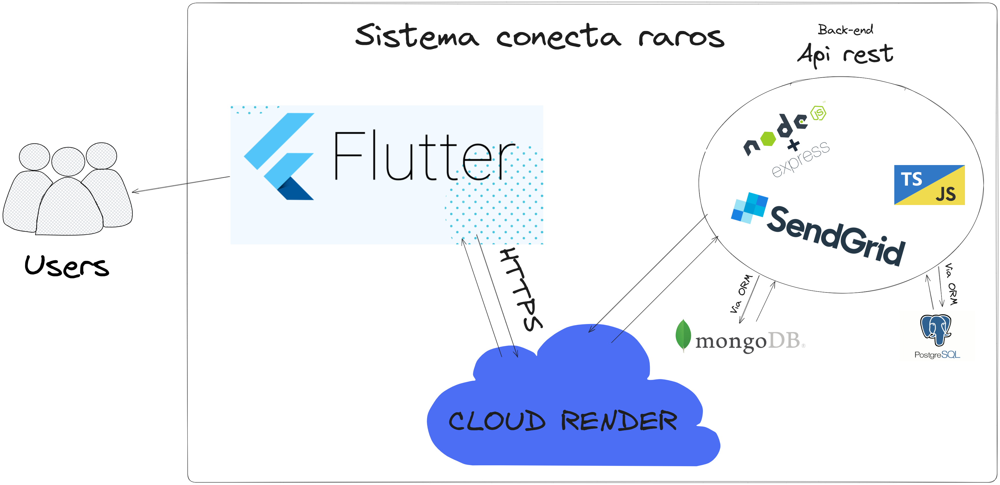
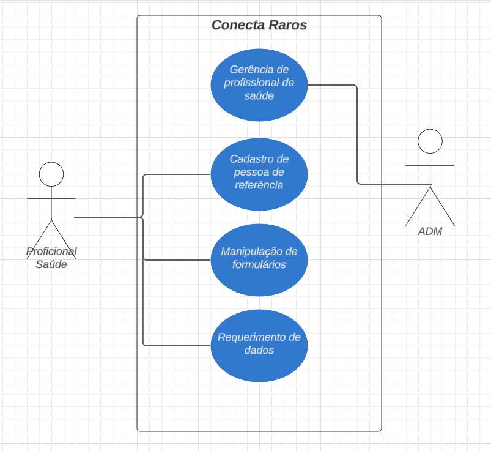
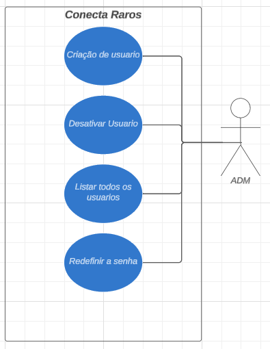

# DESENVOLVIMENTO

O **Conecta Raros** é um sistema integrado que contempla tanto uma aplicação de back-end quanto uma interface visual de front-end. O projeto foi desenvolvido com foco na criação de uma plataforma de notificação voltada para profissionais de saúde, inspirando-se no funcionamento do Sistema de Informação de Agravos de Notificação (SINAN). A proposta busca oferecer uma solução eficiente e acessível para a coleta e o compartilhamento de informações sobre doenças genéticas raras e ultra-raras.

No **back-end**, foram utilizadas as linguagens **JavaScript** e **TypeScript**, executadas por meio do ambiente de execução **Node.js**. Para a construção do servidor, utilizou-se a biblioteca **Express**, que oferece funcionalidades robustas para o desenvolvimento de APIs. Além disso, foi integrada a biblioteca **SendGrid**, destinada ao envio de e-mails de forma eficiente e segura.

O sistema faz uso de dois bancos de dados distintos: o **PostgreSQL**, um banco de dados relacional amplamente utilizado, e o **MongoDB**, um banco de dados orientado a documentos. Essa combinação garante flexibilidade e escalabilidade ao projeto. A aplicação de back-end segue uma arquitetura baseada em conceitos de **arquitetura limpa** ou **hexagonal**, garantindo maior organização e independência entre os componentes do sistema. A comunicação entre o back-end e o front-end ocorre por meio de uma **RESTful API**, utilizando o protocolo **HTTP**. Para a hospedagem, o back-end foi implementado na infraestrutura de nuvem oferecida pela **Render Cloud**, que proporciona alta disponibilidade e escalabilidade.

No **front-end**, foi desenvolvida uma aplicação móvel utilizando a linguagem **Dart** e a framework **Flutter**, conhecida por sua capacidade de criar aplicações móveis híbridas. Essa escolha permite que o sistema seja executado em diferentes plataformas, garantindo uma experiência de usuário uniforme e acessível para dispositivos Android e iOS.

*Fonte: Elaborado pelo autor*

## Tecnologias utilizadas no projeto

### JavaScript/TypeScript
JavaScript é uma das linguagens mais populares para o desenvolvimento web, amplamente utilizada para criar interfaces dinâmicas e interativas. No contexto do back-end, quando combinado com o ambiente Node.js, ele permite a criação de servidores rápidos e escaláveis. O TypeScript, por sua vez, é uma extensão do JavaScript que adiciona tipagem estática e ferramentas de desenvolvimento avançadas, como autocompletar e checagem de erros em tempo de desenvolvimento. Isso facilita a manutenção e escalabilidade de projetos complexos, reduzindo erros e garantindo maior consistência no código. A escolha dessas linguagens no projeto garante flexibilidade, compatibilidade com bibliotecas modernas e suporte à escrita de um código limpo e robusto.

### NODE JS
O Node.js surgiu em 2009, desenvolvido por Ryan Dahl, com o objetivo de solucionar limitações comuns nos servidores tradicionais, como o Apache, que utilizam múltiplas threads para lidar com conexões simultâneas. Esses servidores enfrentavam problemas de desempenho e consumo excessivo de recursos, especialmente em aplicações com grande volume de requisições. Inspirado por modelos baseados em eventos, como o do servidor Nginx, Dahl criou o Node.js, permitindo que os desenvolvedores utilizassem JavaScript no backend de forma eficiente. Essa abordagem unificou o uso de uma única linguagem tanto no cliente quanto no servidor, o que simplificou o desenvolvimento e trouxe maior produtividade.

A arquitetura do Node.js é baseada em um modelo de entrada/saída não bloqueante e dirigido a eventos, operando em uma única thread. Isso é viabilizado por seu "event loop", que gerencia as requisições de maneira assíncrona e permite que o servidor continue processando novas conexões enquanto opera em tarefas de I/O. Essa característica o torna extremamente leve e eficiente, ideal para aplicações que demandam alto volume de conexões simultâneas, como sistemas em tempo real, APIs RESTful e microsserviços. Além disso, o Node.js é alimentado pelo motor V8, da Google, que compila JavaScript diretamente para código máquina, garantindo alta performance.

O Node.js desempenha um papel fundamental no desenvolvimento de APIs REST devido à sua arquitetura leve, eficiente e orientada a eventos. APIs REST, que seguem o padrão de transferência de estado representacional, dependem de requisições HTTP para criar, ler, atualizar e deletar recursos (operações CRUD). O modelo não bloqueante do Node.js permite que múltiplas requisições sejam processadas simultaneamente sem a necessidade de criar uma nova thread para cada conexão, reduzindo o consumo de recursos e otimizando a performance. Essa abordagem é particularmente útil em APIs REST, que frequentemente lidam com grandes volumes de requisições, como em aplicativos de e-commerce ou redes sociais.

Além disso, o ecossistema do Node.js conta com frameworks como Express.js, que simplifica a criação e gestão de rotas e middleware para APIs REST. Esses frameworks ajudam os desenvolvedores a implementar endpoints de maneira modular e escalável, permitindo integrar facilmente bancos de dados, autenticação e outras funcionalidades essenciais. A capacidade do Node.js de lidar com JSON nativamente, tanto no cliente quanto no servidor, o torna uma escolha natural para a construção de APIs REST, já que esse é o formato padrão de troca de dados em serviços web modernos. Como resultado, o Node.js tem se consolidado como uma solução eficiente e versátil para construir APIs REST que atendem às demandas de aplicações modernas.

Apesar de suas inúmeras vantagens, o Node.js possui algumas limitações que devem ser consideradas ao escolher a tecnologia para projetos específicos. Uma das principais limitações é sua incapacidade de lidar eficientemente com tarefas computacionalmente intensivas, como processamento pesado de dados ou cálculos matemáticos complexos. Isso ocorre porque o Node.js opera em um modelo single-threaded, e qualquer operação intensiva pode bloquear o "event loop", impactando o desempenho geral da aplicação e impedindo o processamento de outras requisições.

Outro ponto é a complexidade associada ao gerenciamento de callbacks em aplicações que fazem uso extensivo de operações assíncronas, problema conhecido como "callback hell". Embora ferramentas como Promises e Async/Await tenham mitigado essa dificuldade, o design inicial do Node.js pode dificultar o desenvolvimento e a manutenção de código em projetos grandes e complexos. Além disso, a natureza imatura de alguns pacotes no ecossistema NPM, que pode incluir dependências mal documentadas ou inseguras, exige cuidado adicional dos desenvolvedores ao escolher bibliotecas para seus projetos. Por fim, o uso de bancos de dados relacionais em Node.js pode apresentar desafios devido à falta de integração nativa com essas tecnologias, já que o ambiente foi inicialmente otimizado para trabalhar com bancos não relacionais como MongoDB.

O Node.js é uma ferramenta poderosa que trouxe inovações significativas ao desenvolvimento de aplicações backend, especialmente em sistemas que exigem alta performance e escalabilidade, como APIs REST e aplicações em tempo real. Sua arquitetura baseada em eventos e I/O não bloqueante, combinada com o uso do motor V8 da Google, permite processar múltiplas requisições simultaneamente com eficiência e baixa utilização de recursos. Além disso, a possibilidade de utilizar JavaScript em todo o stack facilita o trabalho dos desenvolvedores, promovendo maior consistência e produtividade.

Por outro lado, o Node.js não é uma solução universal. Suas limitações, como o modelo single-threaded que impacta o desempenho em tarefas computacionalmente intensivas, e a complexidade do gerenciamento de operações assíncronas, demandam atenção no planejamento do projeto. Apesar desses desafios, frameworks robustos como Express.js e um ecossistema de pacotes em constante evolução tornam o Node.js uma escolha viável e estratégica para muitos tipos de aplicações modernas. Quando bem utilizado, ele pode oferecer um equilíbrio ideal entre velocidade, flexibilidade e escalabilidade, consolidando-se como uma tecnologia essencial no desenvolvimento web atual.

### EXPRESS
Express é uma biblioteca minimalista e flexível para Node.js que fornece uma estrutura para criar servidores web e APIs de maneira rápida e eficiente. Ela abstrai a complexidade de gerenciar rotas HTTP, middleware e sessões, permitindo que desenvolvedores se concentrem na lógica de negócios. No Conecta Raros, o Express facilita a criação de uma API RESTful para conectar o back-end com o front-end, gerenciando requisições e respostas de maneira eficiente. Sua simplicidade não compromete a robustez, já que ela é extensível por meio de middlewares personalizados e bibliotecas de terceiros, o que a torna uma escolha ideal para projetos modernos.

### SendGrid
O SendGrid é uma plataforma de envio de e-mails baseada em nuvem, amplamente utilizada para garantir a entrega eficiente e segura de mensagens. Ele permite gerenciar grandes volumes de e-mails com alta taxa de entrega, além de oferecer ferramentas para rastreamento, personalização e automação de envios. No projeto Conecta Raros, o SendGrid é usado para envio de notificações importantes, como confirmações de registro, alertas ou comunicações relacionadas à saúde. Sua integração com Node.js é simples e permite o envio programático de e-mails personalizados, garantindo confiabilidade nas comunicações do sistema.

### PostgreSQL
PostgreSQL é um banco de dados relacional de código aberto, conhecido por sua robustez, confiabilidade e suporte avançado a consultas complexas. Ele oferece recursos como transações ACID, índices avançados e extensões, tornando-o ideal para armazenar dados estruturados e garantir integridade. No Conecta Raros, o PostgreSQL é utilizado para gerenciar informações relacionais, como registros de notificações, usuários e dados epidemiológicos. Sua capacidade de lidar com grandes volumes de dados e executar consultas complexas de forma eficiente é essencial para o sistema.

### MongoDB
MongoDB é um banco de dados NoSQL orientado a documentos, projetado para lidar com grandes volumes de dados não estruturados e em constante evolução. Ele armazena dados no formato JSON-like, permitindo flexibilidade e escalabilidade em sua estruturação. No Conecta Raros, o MongoDB é utilizado para armazenar informações que não seguem um esquema rígido, como metadados ou logs do sistema. Sua alta performance em operações de leitura e escrita o torna uma excelente escolha para complementar o PostgreSQL, garantindo que diferentes tipos de dados sejam tratados de maneira eficiente.

### Render Cloud
Render Cloud é uma plataforma de hospedagem em nuvem que oferece serviços de alta disponibilidade, escalabilidade automática e integração simplificada para aplicações web e APIs. Ela suporta a execução de servidores em ambientes seguros, com backup automatizado e monitoramento em tempo real. No projeto Conecta Raros, a Render Cloud hospeda o back-end, garantindo que a aplicação esteja sempre acessível aos usuários, mesmo em momentos de alta demanda. Sua infraestrutura facilita o gerenciamento de recursos, permitindo que a equipe de desenvolvimento se concentre na funcionalidade do sistema em vez de lidar com detalhes técnicos de infraestrutura.

### Dart
Dart é uma linguagem de programação criada pelo Google, projetada para o desenvolvimento de aplicações modernas e performáticas. Sua tipagem estática opcional e sintaxe clara facilitam a escrita de código limpo e organizado. No Conecta Raros, o Dart é usado em conjunto com o framework Flutter para desenvolver o aplicativo móvel. Ele oferece alta eficiência e ferramentas que agilizam o desenvolvimento, como suporte a hot reload, permitindo alterações rápidas e visualização instantânea no código.

### Flutter
Flutter é um framework de código aberto desenvolvido pelo Google para criar aplicações híbridas, permitindo o desenvolvimento de interfaces móveis para Android e iOS a partir de um único código. Ele é conhecido por sua alta performance, uso do motor gráfico Skia e capacidade de criar interfaces ricas e responsivas. No Conecta Raros, o Flutter é utilizado para desenvolver o front-end do sistema, garantindo uma experiência de usuário fluida e consistente, além de reduzir os custos e o tempo de desenvolvimento, já que a mesma base de código é reutilizada para múltiplas plataformas.

## Conecta raros como um banco de dados descentralizado para patologias de doenças genéticas raras

O **Conecta Raros** se apresenta como um sistema essencial na centralização e organização de informações sobre doenças genéticas raras e ultrarraras. Em um contexto onde a falta de dados acessíveis é um desafio significativo, a descentralização de informações sobre patologias se torna vital para avanços na área médica.

A descentralização possibilita a criação de um ambiente colaborativo, onde profissionais da saúde, estudantes e pesquisadores têm acesso a um repositório confiável e atualizado de informações. Um dos principais motivos que destacam a importância desse sistema é a **redução de erros de diagnóstico**. Erros são comuns em doenças genéticas raras devido à falta de conhecimento especializado e de recursos adequados para identificar e tratar corretamente essas condições.

Essa limitação, além de comprometer a qualidade do diagnóstico, é perigosa, pois pode resultar em prescrições de medicamentos inadequados. Muitas dessas patologias possuem restrições rigorosas quanto ao uso de determinadas drogas, e o uso equivocado pode **agravar significativamente o quadro clínico** dos pacientes. Em outros casos, mesmo que a medicação incorreta não piore a condição, ela falha em tratar as crises ou sintomas necessários, deixando os pacientes vulneráveis.

Outro ponto de grande importância é a **visibilidade dos casos**. As organizações não governamentais (ONGs) que atuam no suporte a pessoas com essas patologias frequentemente enfrentam desafios para mobilizar apoio e recursos. Isso ocorre porque, por serem condições raras ou ultrarraras, a maioria da população desconhece sua existência e, por consequência, não se engaja em campanhas de ajuda e conscientização.

Com um sistema de banco de dados robusto e descentralizado, que fornece dados estatísticos sobre a incidência das patologias, é possível oferecer às ONGs um **arcabouço de informações confiáveis** para embasar suas campanhas. Dados como o número de pacientes afetados, a distribuição geográfica e os impactos das doenças permitem que essas organizações lutem com mais efetividade pelos direitos dos pacientes, incluindo a inclusão de medicamentos necessários no Sistema Único de Saúde (SUS). Medicamentos para doenças genéticas raras são, em geral, extremamente caros, e a falta de visibilidade impede a implementação de **políticas públicas e sanitárias adequadas**.

Além disso, o sistema **Conecta Raros** oferece uma oportunidade única para os **órgãos de saúde** planejarem suas ações com base em dados não sensíveis. Informações organizadas e detalhadas sobre a incidência e a distribuição das patologias permitem que esses órgãos elaborem estratégias de prevenção, diagnóstico precoce e tratamento adequado. Isso possibilita a implementação de **políticas públicas efetivas** e a alocação mais eficiente de recursos, garantindo suporte às pessoas acometidas por essas doenças.

Ao fornecer dados não sensíveis e organizados, o **Conecta Raros** oferece às ONGs ferramentas concretas para dialogar com o governo e a sociedade, evidenciando a relevância de medidas efetivas em apoio aos pacientes. Dessa forma, o sistema de banco de dados não apenas amplia a visibilidade das patologias, mas também contribui para **mobilização social**, conscientização pública e formulação de políticas que garantam o acesso a tratamentos e medicamentos indispensáveis.

Com o **Conecta Raros**, não apenas ampliamos o acesso à informação, mas também incentivamos um ecossistema de colaboração e aprendizado contínuo. Essa abordagem descentralizada é um passo importante para enfrentar as lacunas de conhecimento e garantir um futuro onde pacientes com doenças genéticas raras recebam a atenção e o cuidado adequados.

## Estrutura técnica do sistema

Para implementar o sistema **Conecta Raros**, foi desenvolvida uma **API REST** utilizando **Node.js** e **Express**. A escolha dessa arquitetura se deve à necessidade de escalabilidade e flexibilidade, permitindo que o servidor seja hospedado em plataformas de nuvem ou em servidores próprios. Essa abordagem possibilita a expansão conforme a demanda por recursos aumenta, mantendo a estabilidade e o desempenho do sistema.

A API REST foi projetada para permitir integração com diversas plataformas, facilitando o consumo dos dados em **aplicações web, mobile e desktop**. Adicionalmente, foram disponibilizadas rotas públicas que fornecem acesso aos dados essenciais, possibilitando a utilização por outros sistemas e o desenvolvimento de soluções independentes pela comunidade interessada. Essa estrutura favorece a reutilização e a expansão do sistema com base em padrões abertos.

O armazenamento dos dados foi implementado com o **MongoDB**, um banco de dados **não relacional**. A escolha desse banco se justifica pela dinamicidade das informações relacionadas às doenças genéticas raras, que estão sujeitas a constantes atualizações e descobertas. O MongoDB utiliza **collections**, o que permite uma maior flexibilidade no modelo de dados, facilitando a incorporação de novas informações sem a necessidade de migrações complexas e custosas, características de bancos relacionais.

A arquitetura proposta, composta por uma **API REST** e um banco de dados **MongoDB**, assegura uma solução eficiente e adaptável às necessidades do sistema. Essa combinação permite que os dados sejam acessados de forma estruturada e organizada, proporcionando maior facilidade no processamento e na disponibilização de informações sobre patologias genéticas raras.

Ao disponibilizar dados não sensíveis de maneira organizada, o **Conecta Raros** fornece subsídios para que **ONGs, órgãos de saúde e pesquisadores** possam utilizar essas informações em suas análises e tomadas de decisão. Esse processo viabiliza o planejamento de estratégias mais eficazes para o acompanhamento e tratamento das doenças genéticas raras.

Dessa forma, o sistema **Conecta Raros** se configura como uma ferramenta técnica essencial para a consulta e gestão de informações, promovendo suporte à pesquisa científica, à educação e à formulação de políticas públicas direcionadas às patologias genéticas raras. A estrutura desenvolvida favorece a troca de conhecimento, a precisão no diagnóstico e a definição de tratamentos mais adequados, alinhando os objetivos do sistema com os avanços científicos e tecnológicos na área da saúde.

## Estruturação do Banco de dados

O **Conecta Raros** utiliza o **PostgreSQL** como banco de dados relacional exclusivamente para o gerenciamento de usuários do sistema. Essa escolha foi feita com base na robustez e confiabilidade oferecidas pelos bancos relacionais para dados estruturados, como o cadastro de usuários, garantindo segurança, integridade e consistência. Os perfis de usuários do sistema são classificados em dois tipos principais: **ADMIN** e **USER**, com características e permissões distintas que refletem suas funções no sistema.

*Fonte: Elaborado pelo autor*

### Por que utilizar um banco relacional para o gerenciamento de usuários?

A decisão de usar um banco relacional para gerenciar os usuários está relacionada à sua capacidade de garantir integridade e consistência nos dados. Bancos relacionais como o **PostgreSQL** permitem a criação de esquemas bem definidos, assegurando que informações críticas, como e-mail e senha, sigam restrições rígidas (como unicidade e obrigatoriedade). Além disso, os recursos de transação garantem que operações como a criação, edição ou exclusão de usuários sejam executadas de forma segura, minimizando a possibilidade de inconsistências nos dados.

Por outro lado, um banco não relacional, como o **MongoDB**, não seria ideal para o cadastro de usuários, pois não oferece a mesma estruturação e controle sobre os dados. Embora os bancos não relacionais sejam mais flexíveis para armazenar dados dinâmicos e semi-estruturados, eles não são tão eficientes para lidar com relações complexas ou garantir a integridade em situações críticas como autenticação e autorização de usuários. Portanto, para um cenário onde a segurança e a consistência dos dados são fundamentais, um banco relacional é a escolha mais adequada.

### Perfil ADMIN

No **Conecta Raros**, o **ADMIN** é o único administrador do sistema, sendo responsável por executar todas as tarefas administrativas relacionadas ao gerenciamento de usuários. Diferentemente do usuário profissional de saúde, o **ADMIN** não precisa ser um profissional de saúde, e por isso o campo **CRM** é sempre nulo para este perfil. Além disso, o sistema permite que exista apenas um **ADMIN**, que é configurado no momento da implantação e indicado pelos responsáveis pela implementação.

Entre suas principais funções, o **ADMIN** pode criar novos usuários profissionais de saúde, registrando informações como nome completo, e-mail e CRM. Essa funcionalidade garante que novos profissionais sejam habilitados para acessar o sistema e desempenhar suas funções. O **ADMIN** também tem a permissão de desativar usuários profissionais de saúde, o que assegura maior controle e segurança ao impedir o acesso de contas inativas ou que não devem mais utilizar o sistema. Além disso, ele pode listar todos os usuários profissionais de saúde cadastrados, visualizando informações como nome, status ativo/inativo e outras características, facilitando o gerenciamento e o monitoramento.

*Fonte: Elaborado pelo autor*

Por fim, o **ADMIN** possui a capacidade de redefinir sua própria senha por meio de um sistema automatizado de redefinição, permitindo que atualize suas credenciais sempre que necessário de maneira prática e segura. Essas funcionalidades conferem ao **ADMIN** controle total sobre a gestão de usuários no sistema, garantindo um ambiente organizado, seguro e alinhado às necessidades dos profissionais de saúde.

### Perfil USER

O **USER** é reservado exclusivamente para profissionais de saúde que utilizam o sistema para realizar atividades operacionais. O campo **CRM** é obrigatório para todos os **USERS**, validando que apenas profissionais devidamente registrados possam acessar e manipular os dados no sistema.
